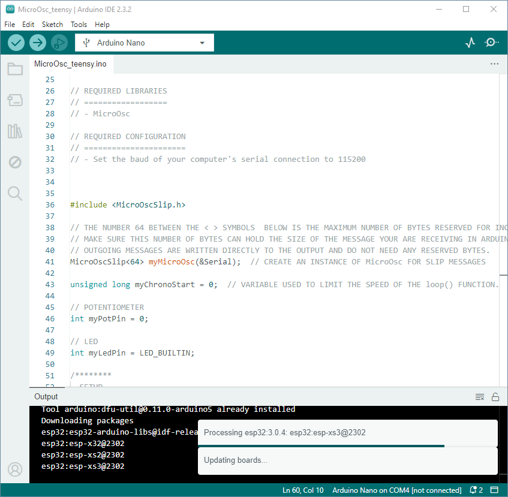

# Installer Arduino IDE

## Préalable(s)

Aucun préalable.

## Téléchargment

- [Télécharger la dernière version d'Arduino IDE](https://www.arduino.cc/en/software) qui devrait être au minimum la version 2!

## Documentation officielle

- [Documentation officielle sur l'utilisation de l'Arduino IDE 2](https://docs.arduino.cc/software/ide/)
- [Documentation officielle de la programmation avec le langage Arduino](https://docs.arduino.cc/programming/)

## Fenêtre principale du logiciel Arduino IDE

L'environnement de développement intégré Arduino, *Arduino Integrated development environment* en anglais, ou **Arduino IDE** est outil pour programmer les microcontrôleurs dédié à l'apprentissage.

Voici les fonctions de la barre d'îcones de gauche à droite :
1. Vérifier le programme et en identifier les erreurs.
2. Vérifier le programme et en identifier les erreurs. Envoyer par la suite le code compilé à la carte Arduino.
3. Débogage (seulement utilisé pour certains modèles de cartes).
4. Moniteur graphique.
5. Moniteur textuel.
