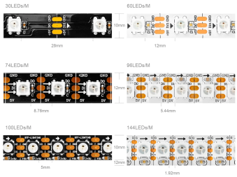
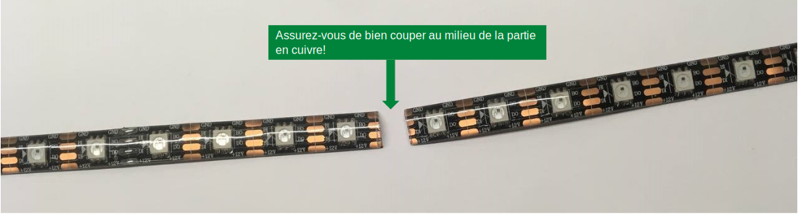
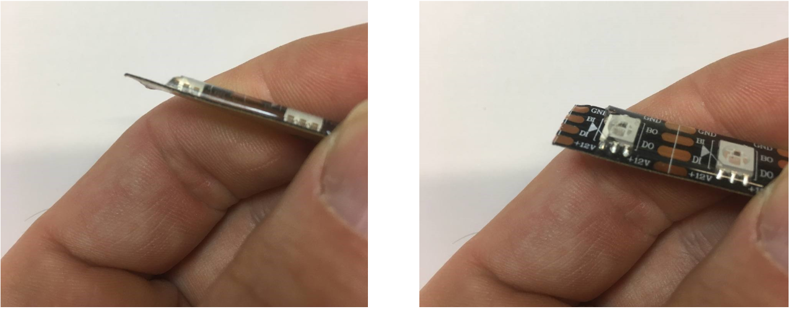
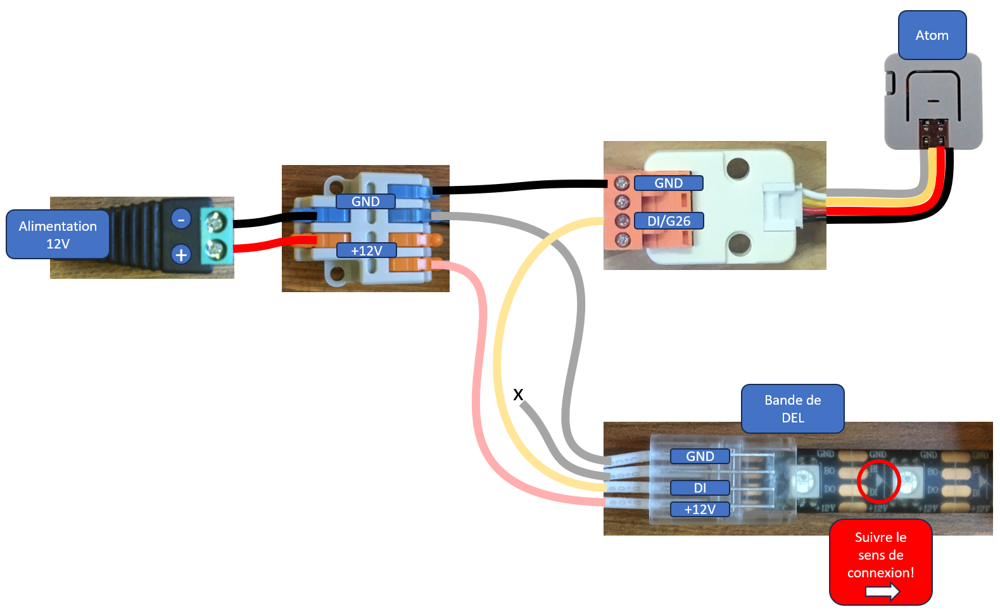

# Contrôler une bande de pixels avec un M5Stack Atom

## Introduction

Une bande de pixels regroupe plusieurs LED pouvant être contrôlées avec une ou deux broches. Chaque pixel est composé de plusieurs LED, généralement une rouge, une verte et une bleue. Certains modèles intègrent également des LED supplémentaires blanches, ambrées ou ultraviolettes. De plus, pour chaque modèle de bande de pixels, l'ordre des couleurs peut varier : RGB, GRB, BGR, etc.  

Aussi connue sous le nom de **NeoPixel**, ce type de produit a été popularisé par la société Adafruit, qui propose [de nombreux modèles de NeoPixels](https://www.adafruit.com/category/168). Attention, les NeoPixels d'Adafruit fonctionnent à 5 volts.




## Broches

Les NeoPixels possèdent au moins trois broches qui doivent être connectées :  
- **GND** (masse)  
- **Alimentation** (5 V, 12 V ou 24 V selon les modèles)  
- **Entrée de données** (*Data In*)  

Les modèles WS281X fonctionnant en 12 V comportent parfois une quatrième broche optionnelle :  
- **GND**  
- **+12V** (alimentation)  
- **DI** (entrée de données)  
- **BI** (utilisée uniquement en cas de défaillance d’un segment).


## Branchement

Dans cet exemple, nous utilisons une bande de LED WS281X fonctionnant avec une tension d’alimentation de 12 V.

  
 
  
  
  
  
  


### Bonnes pratiques

Adafruit recommande de suivre [ces bonnes pratiques de connexion](https://learn.adafruit.com/adafruit-neopixel-uberguide/best-practices) pour éviter les problèmes.


## Bibliothèque FastLED

**Les bibliothèques pour bandes de LED supportent souvent plusieurs modèles. Il est important de sélectionner le bon modèle dans le code !**  
Nous recommandons la bibliothèque [FastLED](https://github.com/FastLED/FastLED), qui peut être installée via le gestionnaire de bibliothèques. Elle est très performante, mais un peu complexe à utiliser.


### Initialisation dans le code

#### À ajouter dans l’espace global :
```cpp
#define NOMBRE_PIXELS 30 
CRGB mesPixels[NOMBRE_PIXELS];
```

#### Dans `setup()`
Ajoutez les pixels à FastLED. La broche 26 correspond à celle du M5Stack Atom pour envoyer les données à la bande de pixels :
```cpp
FastLED.addLeds<WS2812, 26, RGB>(mesPixels, NOMBRE_PIXELS);
```

#### Dans `loop()`
Pour modifier la couleur d’un pixel, changez sa valeur dans le tableau :
```cpp
int indexDuPixel = 13;
int rouge = 255;
int vert = 255;
int bleu = 255;
mesPixels[indexDuPixel] = CRGB(rouge, vert, bleu);
```
Ensuite, mettez à jour l’affichage :
```cpp
FastLED.show();
```


### Exemple complet avec animations

Le code ci-dessous contrôle une bande de LED via un M5Stack Atom. Il inclut des animations comme l’arc-en-ciel ou les effets scintillants.


```cpp
// Le code de base pour le M5Stack Atom

// Inclure la librairie M5 (version pour M5Atom) :
// https://github.com/m5stack/M5Atom
#include <M5Atom.h>

// Inclure la librairie FastLED qui va gérer le pixel :
// https://github.com/FastLED/FastLED
#include <FastLED.h>

// Un tableau qui contient une variable de type CRGB.
// Il y a un seul pixel, mais il doit être dans un tableau.
// CRGB est un type de couleur défini par la lirairie FastLed :
// https://github.com/FastLED/FastLED/wiki/Pixel-reference#crgb-reference
CRGB monPixelAtom[1];

#define MA_BANDE_DEL_COMPTE 30
CRGB maBandeDel[MA_BANDE_DEL_COMPTE];

unsigned long monChronoStart;

int monAnimation = 6;


void setup() {
  // Démarrer la libraire M5 avec toutes les options de pré-configuration désactivées :
  M5.begin(false, false, false);

  // Démarrer la connexion sérielle :
  Serial.begin(115200);

  // Ajouter le pixel (il y en a un seul) du M5Atom à la librairie FastLED :
  FastLED.addLeds<WS2812, DATA_PIN, GRB>(monPixelAtom, 1);

  // Utiliser FastLED.addLeds si la bande est connectée directement à l'ATOM
  FastLED.addLeds<WS2812, 26, RGB>(maBandeDel, MA_BANDE_DEL_COMPTE);
  // Utiliser les deux commandes suivantes si la bande est connectée au pbHub
  /*
  myPbHub.begin();
  myPbHub.setPixelCount(MA_BANDE_DEL_CANAL, MA_BANDE_DEL_COMPTE);
  */

  // Animation de démarrage
  while (millis() < 5000) {
    monPixelAtom[0] = CHSV((millis() / 5) % 255, 255, 255 - (millis() * 255 / 5000));
    FastLED.show();
    delay(50);
  }
  monPixelAtom[0] = CRGB(0, 0, 0);
  FastLED.show();
}

void loop() {
  // Toujours inclure M5.update() au début de loop() :
  M5.update();

  if (millis() - monChronoStart >= 50) {
    monChronoStart = millis();
  
    Serial.println(millis());

    uint8_t hue = millis() / 50;

    if (monAnimation == 0) {
      rainbow(maBandeDel, MA_BANDE_DEL_COMPTE, hue);  // run simulation frame
    } else if (monAnimation == 1) {
      rainbowWithGlitter(maBandeDel, MA_BANDE_DEL_COMPTE, hue);
    } else if (monAnimation == 2) {
      confetti(maBandeDel, MA_BANDE_DEL_COMPTE, hue);
    } else if (monAnimation == 3) {
      sinelon(maBandeDel, MA_BANDE_DEL_COMPTE, hue);
    } else if (monAnimation == 4) {
      bpm(maBandeDel, MA_BANDE_DEL_COMPTE, hue);
    } else if (monAnimation == 5) {
      juggle(maBandeDel, MA_BANDE_DEL_COMPTE, hue);
    } else { 
      int count = (millis() / 1000) % 30;
      fill_solid( maBandeDel, MA_BANDE_DEL_COMPTE, CRGB( 0, 0, 0) );
      for (int i=0; i < count ; i++ ) {
        maBandeDel[i] = CRGB( 255, 255, 255);
      }
    }

    // Utiliser FastLED.show() si la bande est connectée directement à l'ATOM
    FastLED.show();

  }
}


void rainbow(CRGB* leds, int ledsCount, uint8_t gHue) {
  // FastLED's built-in rainbow generator
  fill_rainbow(leds, ledsCount, gHue, 7);
}

void addGlitter(CRGB* leds, int ledsCount, fract8 chanceOfGlitter) {
  if (random8() < chanceOfGlitter) {
    leds[random16(ledsCount)] += CRGB::White;
  }
}

void rainbowWithGlitter(CRGB* leds, int ledsCount, uint8_t gHue) {
  // built-in FastLED rainbow, plus some random sparkly glitter
  rainbow(leds, ledsCount, gHue);
  addGlitter(leds, ledsCount, 180);
}


void confetti(CRGB* leds, int ledsCount, uint8_t gHue) {
  // random colored speckles that blink in and fade smoothly
  fadeToBlackBy(leds, ledsCount, 10);
  int pos = random16(ledsCount);
  leds[pos] += CHSV(gHue + random8(64), 200, 255);
}

void sinelon(CRGB* leds, int ledsCount, uint8_t gHue) {
  // a colored dot sweeping back and forth, with fading trails
  fadeToBlackBy(leds, ledsCount, 20);
  int pos = beatsin16(13, 0, ledsCount - 1);
  leds[pos] += CHSV(gHue, 255, 192);
}

void bpm(CRGB* leds, int ledsCount, uint8_t gHue) {

  // colored stripes pulsing at a defined Beats-Per-Minute (BPM)
  uint8_t BeatsPerMinute = 62;
  CRGBPalette16 palette = PartyColors_p;
  uint8_t beat = beatsin8(BeatsPerMinute, 64, 255);
  for (int i = 0; i < ledsCount; i++) {  //9948
    leds[i] = ColorFromPalette(palette, gHue + (i * 2), beat - gHue + (i * 10));
  }
}

void juggle(CRGB* leds, int ledsCount, uint8_t gHue) {
  // eight colored dots, weaving in and out of sync with each other
  fadeToBlackBy(leds, ledsCount, 20);
  uint8_t dothue = 0;
  for (int i = 0; i < 8; i++) {
    leds[beatsin16(i + 7, 0, ledsCount - 1)] |= CHSV(dothue, 200, 255);
    dothue += 32;
  }
}
```

