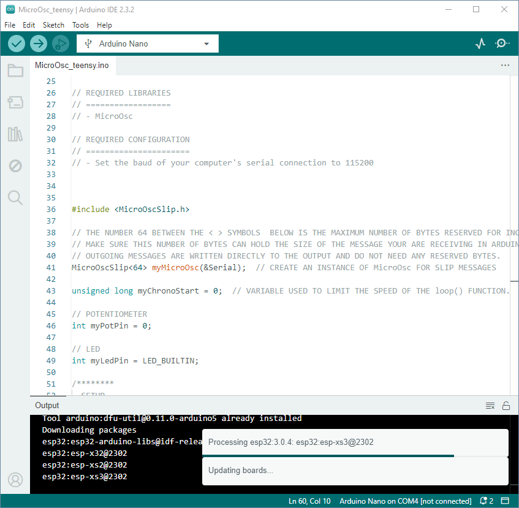

# Arduino IDE

## Préalable(s)

Aucun préalable.

## Téléchargment

- [Télécharger la dernière version d'Arduino IDE 2](https://www.arduino.cc/en/software)

## Documentation officielle

- [Programmation de base](https://docs.arduino.cc/programming/)

## Fenêtre principale du logiciel Arduino IDE

L'environnement de développement intégré Arduino, *Arduino Integrated development environment* en anglais, ou **Arduino IDE** est outil pour programmer les microcontrôleurs dédié à l'apprentissage.

Voici les fonctions des îcones du côté gauche du menu :
1. Vérifier le programme et en identifier les erreurs.
2. Envoyer du programme à la carte Arduino.
3. Créer un nouveau document Arduino.
4. Ouvrir un document Arduino existant.
5. Enregistrer le document Arduino ouvert.