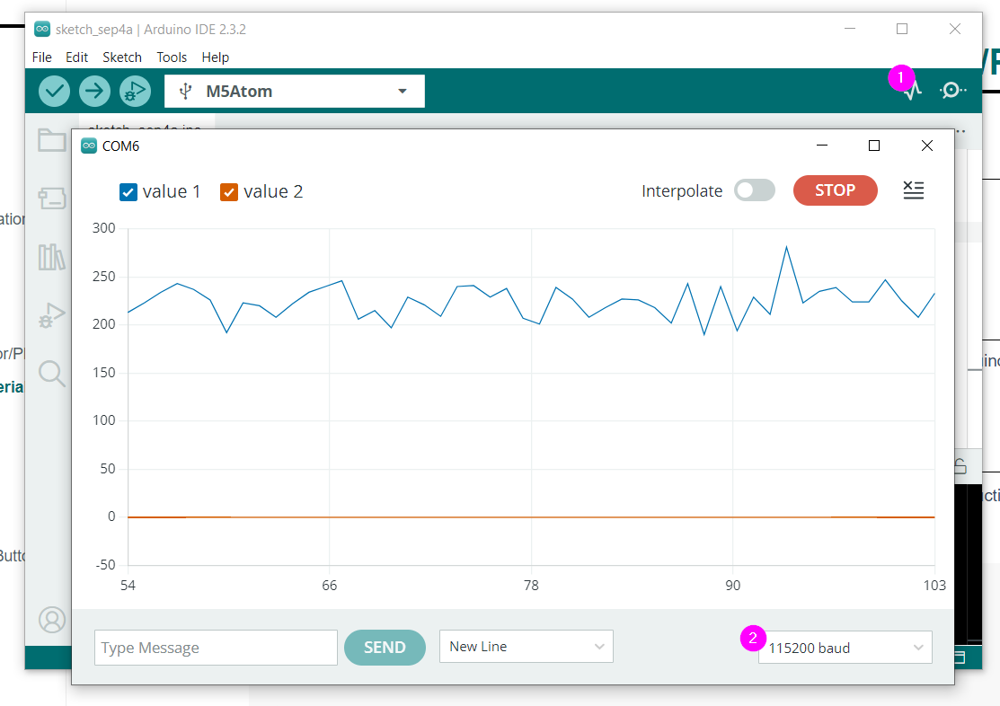

# Tutoriel : Bouton, M5 Angle et Serial Monitor/Plotter

## Préalable(s)

- [Tutoriel: M5 Angle et Serial Monitor/Plotter](/m5stack/atom/tutoriel/angle-monitor.md)	
- [Bouton du M5Stack Atom](/m5stack/atom/bouton.md)

## Le code préalable à intégrer

1) Transcrire le code du [Tutoriel: M5 Angle et Serial Monitor/Plotter](/m5stack/atom/tutoriel/angle-monitor.md) dans un nouveau projet Arduino.

## Code à ajouter au bloc de message

1) Pour envoyer la valeur du bouton en plus de la valeur du M5 Angle, nous devons modifier l'instruction `Serial.println( maLectureAngle )` pour la remplacer par le bloc de code suivant:
```cpp
    Serial.print( maLectureAngle );
    Serial.print(" ");
    Serial.println( maLectureBouton );
```

2) Le contenune de la fonction `loop()` devrait ressembler à ceci :
```cpp
void loop() {
    M5.update();  // Toujours inclure M5.update() au début de loop()
    if ( millis() - monChronoMessages >= 50 ) { // Si 50 millisecondes se sont écoulées
        monChronoMessages = millis(); // Repartir le compteur

        // Ajouter les messages à envoyer ici
        int maLectureAngle = analogRead(MA_BROCHE_ANGLE);
        int maLectureBouton = M5.Btn.isPressed();

        Serial.print(maLectureAngle);
        Serial.print(" ");
        Serial.println(maLectureBouton);

    }
}
```

## Serial Monitor/Plotter

À noter, que dans `setup()`, l'instruction `Serial.begin(115200)` démarre la communication à la vitesse de 115200 baud. Il faudra inscrire cette valeur dans la fenêtre du _Serial Monitor_ ou du _Serial Plotter_.




