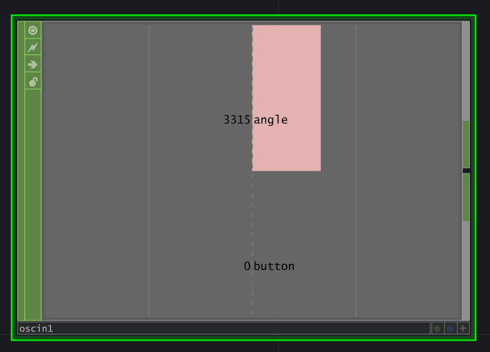
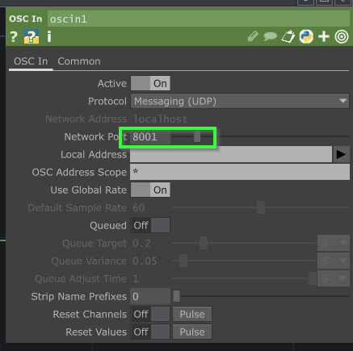

# Réception de l'OSC dans TouchDesigner

## Préalable(s)

- [Protocole Open Sound Control (OSC)](/osc/protocole.md)
- [Tutoriel: OscBridge, M5 Angle et le bouton](/m5stack/atom/tutoriel/angle-button-oscbridge.md)

## Réception d'OSC dans TouchDesigner

### Ajouter un CHOP _Osc In_

###  Configurer les paramètres du _Osc In_

## Réception du bouton dans TouchDesigner

###   Ajouter des CHOP _Select_, _Tail_ et _Null_

###  Configurer les paramètres du _Select_

## Réception du capteur d'angle dans TouchDesigner

###   Ajouter des CHOP _Select_, _Tail_ et _Null_

###  Configurer les paramètres du _Select_

