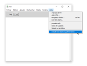
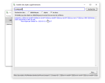

# Relais OSC SLIP ⇄ MIDI avec Pure Data

## Prérequis

Cette solution nécessite l'installation de **Pure Data** ou de **Plug Data**.

## OSC SLIP dans Pure Data

### Installation des objets additionnels pour l'OSC SLIP dans Pure Data

Pour recevoir et envoyer de  l'OSC SLIP, il est nécessaire d'ajouter l'object **comport** à Pure Data.

## Patcher Pure Data pour le relais des messages OSC SLIP ⇄ UDP 

[

Télécharger le patcher ici : [osc_relay.pd](./osc_relay.pd)

