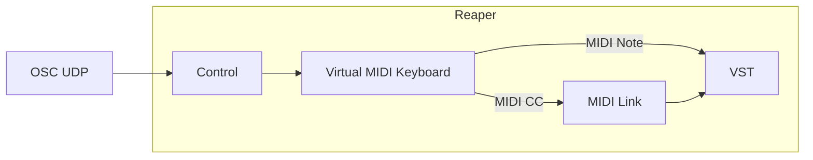
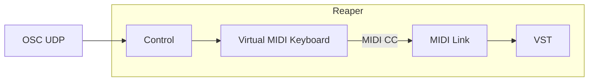

# OSC MIDI dans Reaper

## Préalable(s)

- [OSC dans Reaper](reaper/osc.md)

## Virtual MIDI Keyboard

```mermaid
graph LR
    OSC[OSC UDP] --> Control
    subgraph Reaper
    Control --> VK[Virtual MIDI Keyboard]
    VK -->|MIDI Note| VST
    VK -->|MIDI CC| LINK[MIDI Link]
    LINK --> VST
    end
```
### Ouvrir et configurer le Virtual MIDI Keyboard

#### Lier les MIDI CC

```mermaid
graph LR
    OSC[OSC UDP] --> Control
    subgraph Reaper
    Control --> VK[Virtual MIDI Keyboard]
    VK -->|MIDI CC| LINK[MIDI Link]
    LINK --> VST
    end
```

