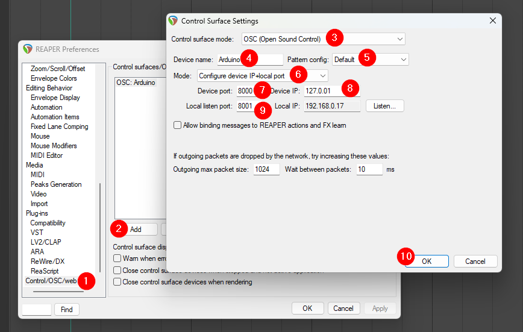

# OSC dans Reaper


## Activer l'OSC dans Reaper



### Fichier de configuration _default pattern_

> To open the default pattern config file folder, select "open config directory" under "pattern config" in the OSC control surface settings dialog. The best way to create a new pattern config is to make a copy of the included Default.ReaperOSC file, rename the copy, and change the patterns defined in the file. Please see the extensive comments in Default.ReaperOSC for more detail about how messages are formed, and what the messages mean

#### Message OSC pour démarrer la lecture dans Reaper

```
/play t
```
* `t` : 1.0 (float)

#### Message OSC pour arrêter la lecture dans Reaper

```
/stop t
```
* `t` : 1.0 (float)

#### Message OSC pour contrôler le volume principal

```
/master/volume n
```
* `n` : 0.0-1.0 (float)

#### Message OSC envoyé par Reaper de la valeur du VU

```
/master/vu n
```
* `n` : 0.0-1.0 (float)

#### Message OSC pour envoyer un MIDI Note au Virtual MIDI Keyboard

```
/vkb_midi/@/note/# i
```
* `@` : canal 0-15 (int)
* `#` : numéro de la note 0-127 (int)
* `i` : vélocité 0-127 (int)

#### Message OSC pour envoyer un MIDI CC au Virtual MIDI Keyboard

```
/vkb_midi/@/cc/# i
```
* `@` : canal 0-15 (int)
* `#` : numéro du CC 0-127 (int)
* `i` : valeur 0-127 (int)


