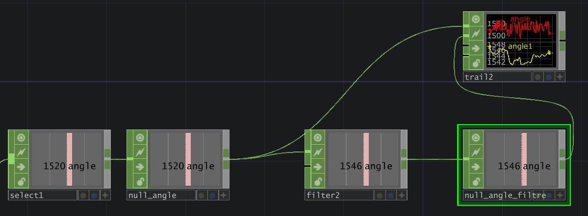
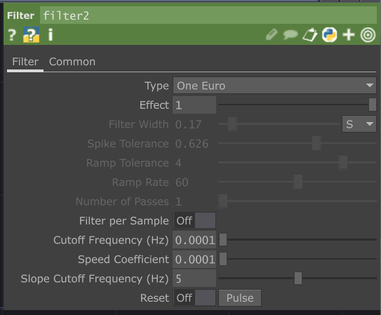

# Filtrer l'angle dans TouchDesigner

## Préalable(s)

- [Tutoriel : Réception de l'OSC dans TouchDesigner](/touchdesigner/tutoriel/reception.md)

## Alterner l'état du bouton

### Ajouter un CHOP _Filter_ et _Null_

###  Configurer les paramètres du _Filter_

