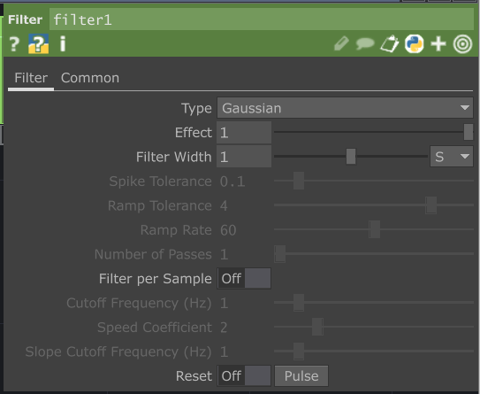

# Traiter l'état du bouton

## Préalable(s)

- [Tutoriel : Réception de l'OSC dans TouchDesigner](/touchdesigner/tutoriel/reception.md)

## Alterner l'état du bouton

### Ajouter des CHOP _Logic_ et _Null_

###  Configurer les paramètres du _Logic_

## Optionnel : ajouter un fondu à l'état du bouton

### Ajouter un CHOP _Filter_ entre les CHOP _Logic_ et _Null_

###  Configurer les paramètres du _Filtre_
