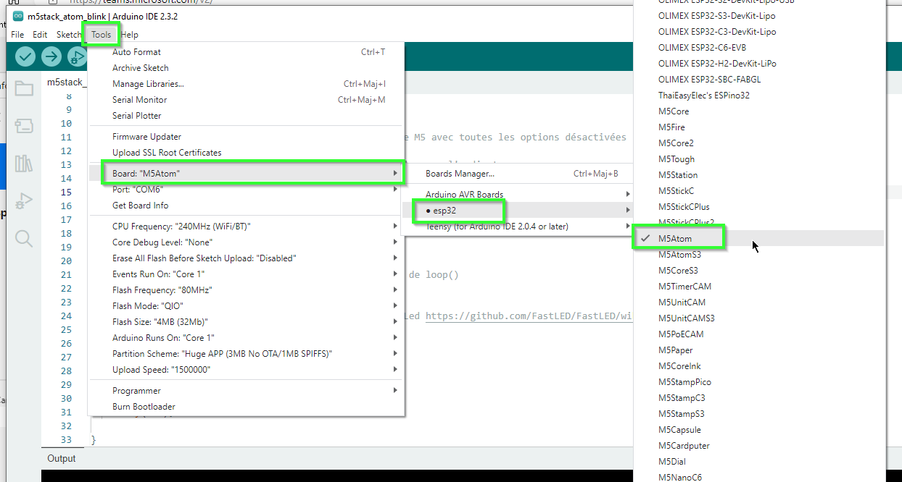
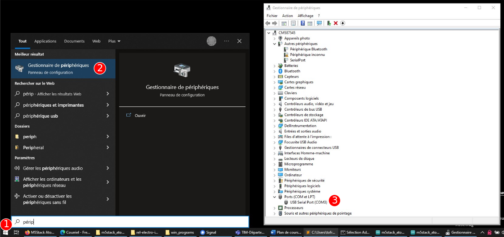
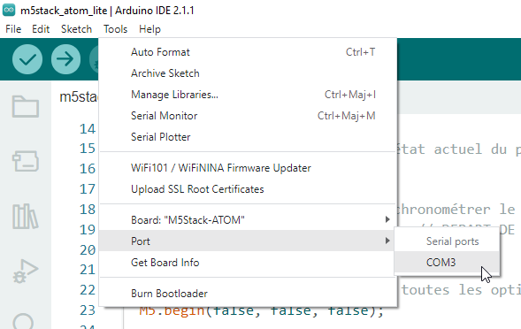

# Configuration d'Arduino IDE pour le M5Stack Atom

## Préalable(s)

- [Installer les dépendances pour M5Stack Atom](/m5stack/atom/installation.md)

## Choisir la bonne plateforme

## Identifier le port

## Choisir le port

