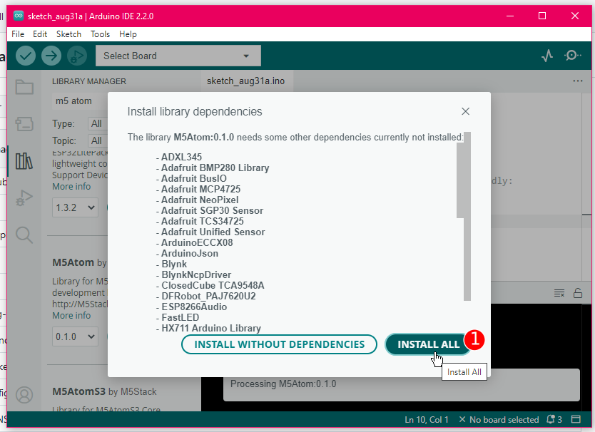

# Installation de M5Stack Atom dans Arduino

## Préalable(s)

- [Installer Arduino IDE](/arduino/ide/installation.md)

## Page du produit

 [Page de produit du ATOM Lite ESP32 IoT Development Kit sur m5stack-store](https://shop.m5stack.com/products/atom-lite-esp32-development-kit)

## Ouvrir le gestionnaire de carte


## Ajouter l'URL du gestionnaire de carte d'ESP32

Voici l'URL à ajouter : 
```
https://espressif.github.io/arduino-esp32/package_esp32_index.json
```


## Trouver et installer le gestionnaire de carte d'ESP32


## Trouver la bibliothèque M5Atom


## Ajouter la bibliothèque M5Atom


