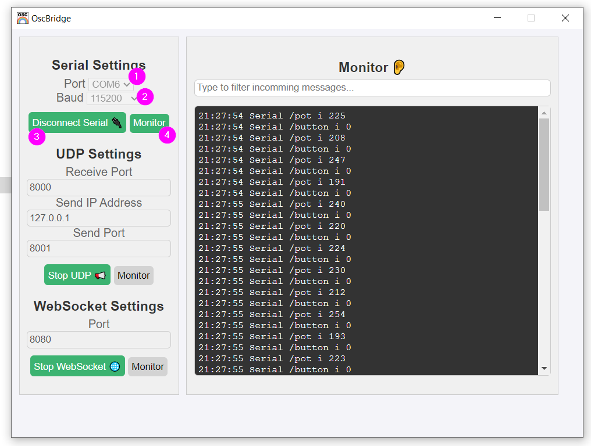

# Tutoriel: OscBridge, M5 Angle et le bouton

## Préalable(s)

- Se familiariser avec [L'envoi d'OSC avec MicroOsc](/osc/microosc/envoi.md)
- Télécharger la bibliothèque **MicroOsc** dans le gestionnaire de bibliothèques d'Arduino.
- Télécharger la dernière version d'OscBridge pour Windows : [OscBridge Latest Release](https://github.com/thomasfredericks/OscBridge/releases/lateste)

## Le code préalable à intégrer

1) Transcrire le [Code de base du M5Stack Atom](/m5stack/atom/code-base.md) dans un nouveau projet Arduino.

## Ajouter l'intégration de MicroOsc

S'assurer que *MicroOsc* est inclu et instancié dans **l'espace global**; ici l'instance est nommée `monOsc` :
```cpp
#include <MicroOscSlip.h>
// Le 128 entre < > below est le nombre d'octets réservés à la réception de messages.
MicroOscSlip<128> monOsc(&Serial);
```

Vérifier que Serial est bien démarré dans `setup()` :
```cpp
Serial.begin(115200);
```

## Rappels

Ne pas oublier que comme indiqué dans la section [M5 Angle Unit](/m5stack/unit/angle.md), c'est une bonne idée d'utiliser un `#define` dans **l'espace global** pour identifier le numéro de la broche du *M5 Angle Unit*:
```cpp
#define MA_BROCHE_ANGLE 32
```

## Code à ajouter au bloc de message

1) Pour envoyer la valeur du M5 Angle, nous utilisons `void sendInt(const char *address, int32_t i)` de **MicroOsc**; elle est envoyée à l'adresse "/pot" :
```cpp
    monOsc.sendInt( "/pot" , maLectureAngle);
```

2) Pour envoyer la valeur du bouton, nous utilisons aussi `void sendInt(const char *address, int32_t i)` de **MicroOsc**; elle est envoyée à l'adresse "/button" :
```cpp
    monOsc.sendInt( "/button" , maLectureBouton);
```

3) Le contenune de la fonction `loop()` devrait ressembler à ceci :
```cpp
void loop() {
    M5.update();  // Toujours inclure M5.update() au début de loop()
    if ( millis() - monChronoMessages >= 50 ) { // Si 50 millisecondes se sont écoulées
        monChronoMessages = millis(); // Repartir le compteur

        // Ajouter les messages à envoyer ici
        int maLectureAngle = analogRead(MA_BROCHE_ANGLE);
        int maLectureBouton = M5.Btn.isPressed();

        monOsc.sendInt( "/pot" , maLectureAngle);
        monOsc.sendInt( "/button" , maLectureBouton);

    }
}
```

## Recevoir les valeurs dans **OscBidge**

