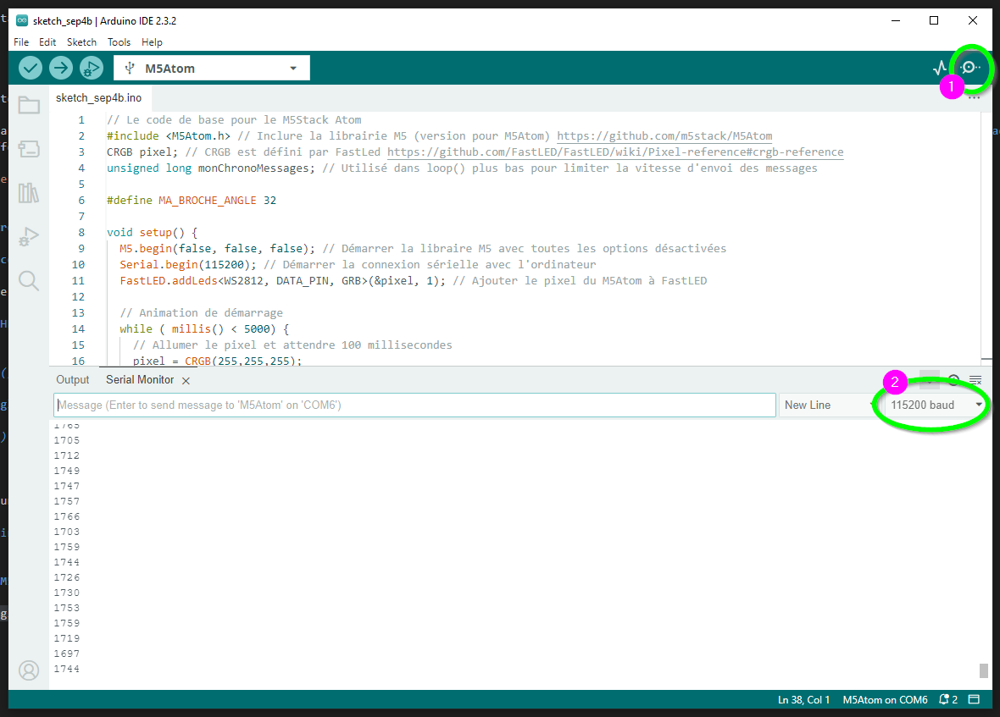
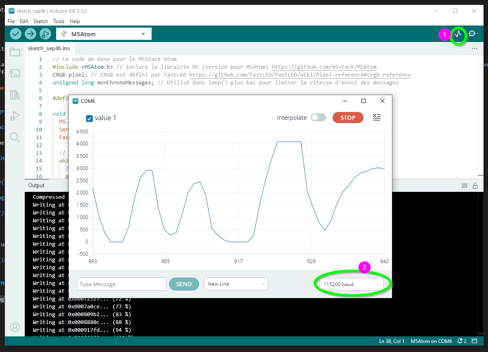

# Tutoriel: M5 Angle et Serial Plotter

## Préalable(s)

- [Code de base du M5Stack Atom](/m5stack/atom/code-base.md)
- [M5 Angle Unit](/m5stack/unit/angle.md)

## Le code préalable à intégrer

1) Transcrire le [Code de base du M5Stack Atom](/m5stack/atom/code-base.md) dans un nouveau projet Arduino.


## Code à ajouter

### Dans l'espace global

Comme indiqué dans la section [M5 Angle Unit](/m5stack/unit/angle.md), c'est une bonne idée d'utiliser un `#define` pour identifier le numéro de la broche du *M5 Angle Unit*:
```cpp
#define MA_BROCHE_ANGLE 32
```

### Dans `loop()`

1) Après avoir intégré le code du [M5 Angle Unit](/m5stack/unit/angle.md) au  [Code de base du M5Stack Atom](/m5stack/atom/code-base.md), la valeur peut être envoyée au Serial Monitor et au Serial Plotter avec un appel à `Serial.println()` :
```cpp
Serial.println( maLectureAngle );
```

2) Placer cet appel dans le block pour l'envoi des messages. Le contenune de la fonction `loop()` devrait ressembler à ceci :
```cpp
void loop() {
    M5.update();  // Toujours inclure M5.update() au début de loop()
        if ( millis() - monChronoMessages >= 50 ) { // Si 50 millisecondes se sont écoulées
            monChronoMessages = millis(); // Repartir le compteur

            // Ajouter les messages à envoyer ici
            int maLectureAngle = analogRead(MA_BROCHE_ANGLE);

            Serial.println(maLectureAngle);
        }
}
```

## Serial Monitor/Plotter

À noter, que dans `setup()`, l'instruction `Serial.begin(115200)` démarre la communication à la vitesse de 115200 baud. Il faudra inscrire cette valeur dans la fenêtre du _Serial Monitor_ ou du _Serial Plotter_.



