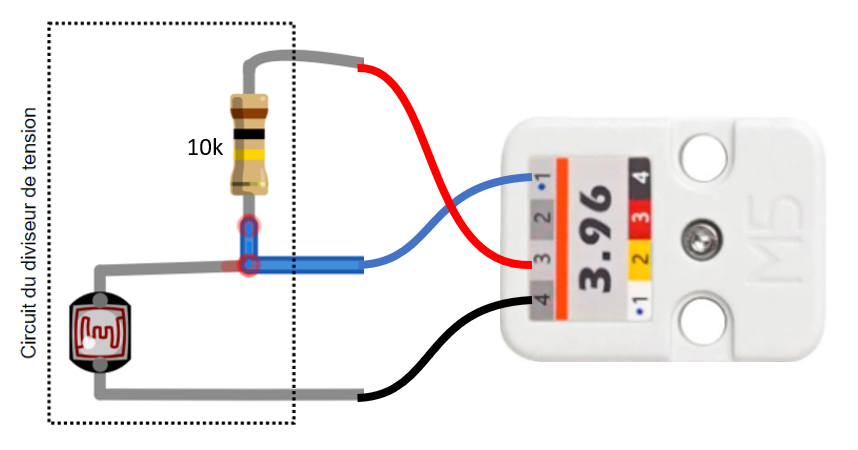

# M5Stack Unit 3.96 et photorésistance

## Préparation



## Utilisation

### Code à ajouter à setup()

Dans `setup()`, initialiser la broche du ATOM Lite :
```cpp
  pinMode(32, INPUT);
```

### Code à utiliser dans la boucle à intervalle régulier dans loop()

Pour obtenir la valeur de la photorésistance :
```cpp
int valeur = analogRead(32);
```
