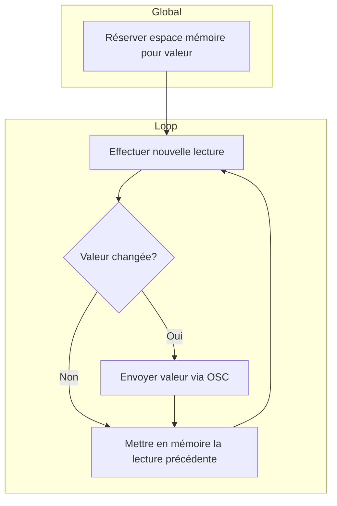

# Envoi d'OSC uniquement quand la valeur a changée



## 1) Réserver espace mémoire pour valeur dans _l'espace global_

```cpp
int maLecturePrecedente;
```

## 2) Dans _loop()_ augmenter la vitesse du bloc de code de communication
```cpp
void loop() {
  M5.update();
  
  // À CHAQUE 20 MILLISECONDES (50 FOIS PAR SECONDE)
  if (millis() - monChronoMessages >= 20) {
    monChronoMessages = millis();
    // ENVOYER LES MESSAGES
  }
```

## 3) Dans _loop()_ et dans le bloc de code de communication

## 3.1) Effectuer nouvelle lecture

Utiliser la méthode appropriée pour mettre à jour la variable :

```cpp
int maLecture = digitalRead(BROCHE);
```

```cpp
int maLecture = analogRead(BROCHE);
```

```cpp
int maLecture = myPbHub.analogRead(CANAL);
```

```cpp
int maLecture = myPbHub.digitalRead(CANAL);
```

## 3.2) Comparer la nouvelle valeur avec la valeur précédente

```cpp
if ( maLecturePrecedente != maLecture ) {
    // ENVOYER LA VALEUR CHANGEE
}
```

## 3.3) Mettre en mémoire la lecture précédente

```cpp
maLecturePrecedente = maLecture
```