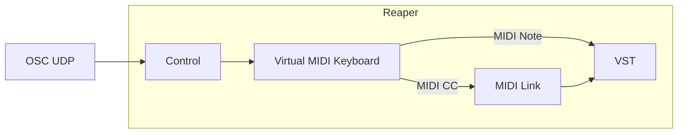
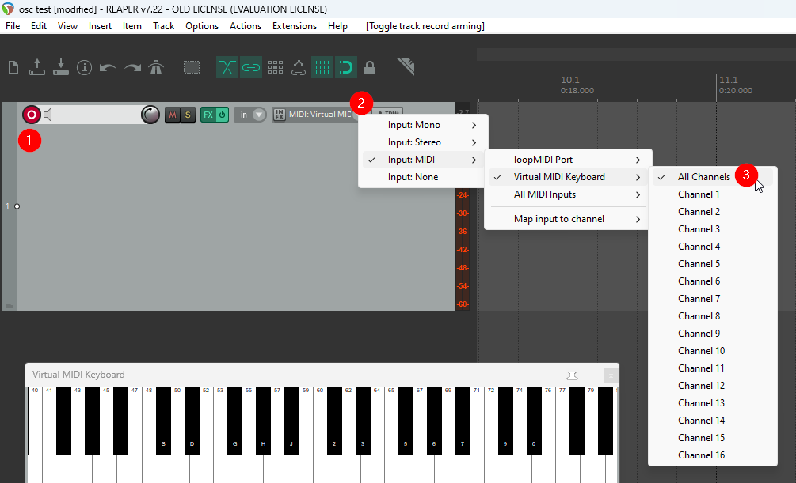
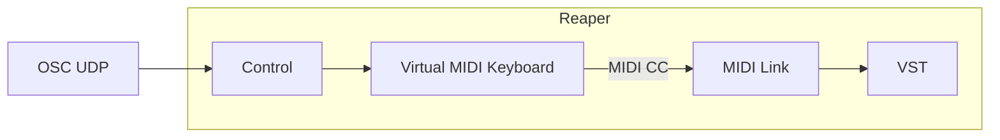
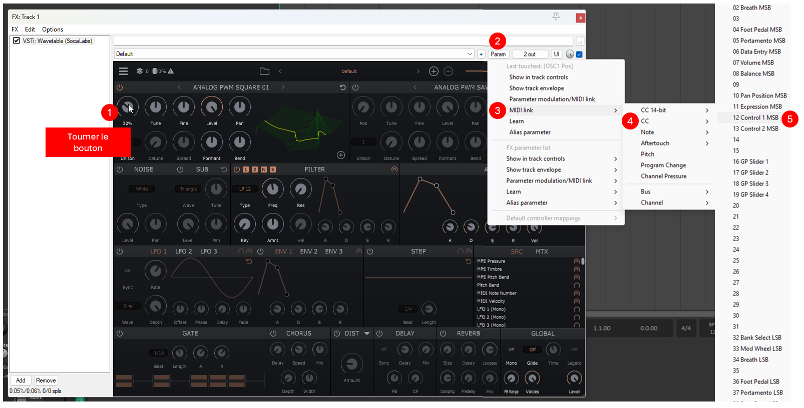

# OSC MIDI dans Reaper

## Préalable(s)

- [OSC dans Reaper](/reaper/osc.md)

## Virtual MIDI Keyboard


### Ouvrir et configurer le Virtual MIDI Keyboard




#### Message OSC pour envoyer un MIDI Note au Virtual MIDI Keyboard

```
/vkb_midi/@/note/# i
```
* `@` : canal 0-15 (int)
* `#` : numéro de la note 0-127 (int)
* `i` : vélocité 0-127 (int)

#### Message OSC pour envoyer un MIDI CC au Virtual MIDI Keyboard

```
/vkb_midi/@/cc/# i
```
* `@` : canal 0-15 (int)
* `#` : numéro du CC 0-127 (int)
* `i` : valeur 0-127 (int)


#### Lier les MIDI CC




