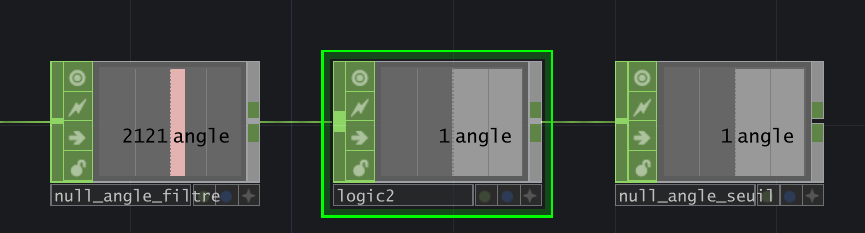
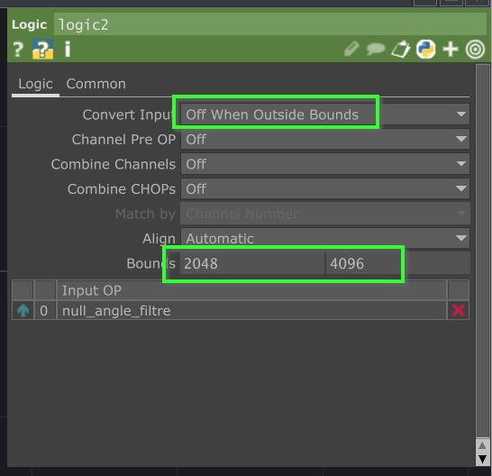

# Tutoriel : Détection de seuil de l'angle

## Préalable(s)

- [Tutoriel : Filtrer l'angle dans TouchDesigner](/touchdesigner/tutoriel/angle_filtrer.md)

## Alterner l'état du bouton

### Ajouter un CHOP _Logic_ et _Null_

###  Configurer les paramètres du _Logic_

