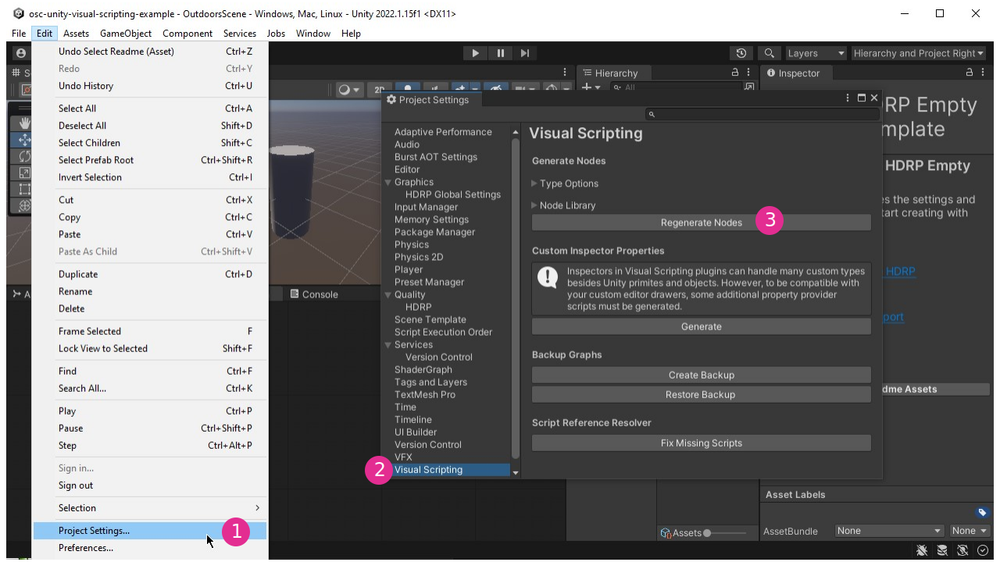
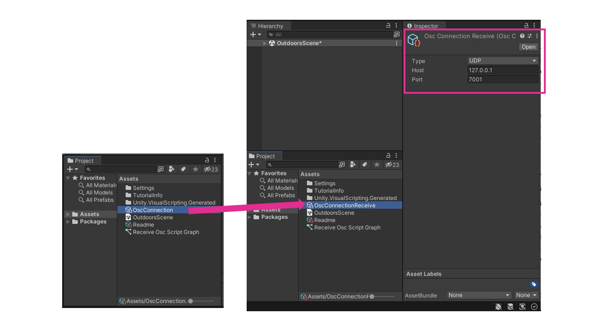
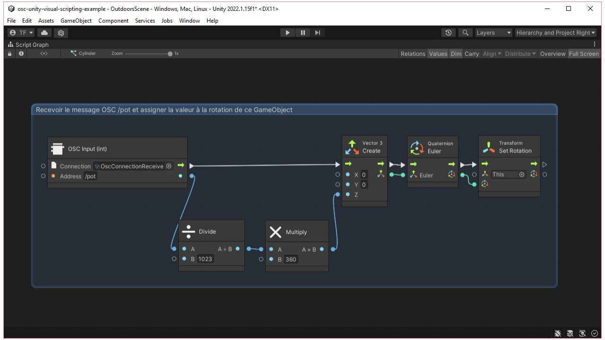

# OSC UDP : Unity

## Avant tout : Activez «Run in Background» dans Unity

Pour que Unity puisse continuer à rouler son code quand sa fenêtre n'est pas en avant plan, cochez la case «Run in Background» dans «Project Settings→Player→Resolution and Presentation→Run in Background» :

## Intégration d'OSCJackVS

Nous utilisons [OSCJackVS](https://github.com/keijiro/OscJackVS) de Keijiro pour traiter les messages OSC UDP dans Unity.

Voici l'information à inscrire dans les paramètres du gestionnaire de paquets (voir figure ci-bas) :
* Name: `Keijiro`
* URL: `https://registry.npmjs.com`
* Scope: `jp.keijiro`

## Assignation du message /pot à la rotation d'un cylindre

